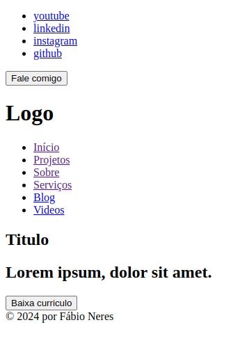

# DevPortfolio-HTML-CSS-JS

Bem-vindo ao DevPortfolio, um repositório que encapsula meu processo de desenvolvimento web ao criar a página inicial de um portfólio para um desenvolvedor front-end. Este projeto foi desenvolvido utilizando HTML, CSS e JavaScript, e tem como objetivo servir tanto como uma apresentação para recrutadores quanto como um guia/tutorial para entusiastas que desejam aprender e se inspirar.

## Autor

| [<br><sub>Fábio Neres</sub>](https://github.com/neresfabio) | Olá, sou o desenvolvedor por trás deste projeto, DevPortfolio-HTML-CSS-JS. Sou apaixonado por transformar ideias em código e criar experiências digitais envolventes. |
| :--------------------------------------------------------------------------------------------------------------------------------------------------: | :-------------------------------------------------------------------------------------------------------------------------------------------------------------------: |

### O que me motiva:

Minha jornada no desenvolvimento web é alimentada pela busca incessante de aprender, crescer e superar desafios no mundo da programação. Acredito no poder da tecnologia para impulsionar mudanças significativas e estou constantemente explorando novas formas de inovar.

## Prototipagem Inicial do Projeto

Durante meu percurso de estudos, conversas com profissionais e participação em bootcamps, acumulei conhecimento suficiente para desenvolver um protótipo inicial para este projeto. A imagem abaixo representa o modelo que elaborei, refletindo a aplicação prática do aprendizado adquirido.

**🚧🚧EM CONSTRUÇÃO🚧🚧**


Este protótipo é meu projeto pessoal, um site totalmente autoral, e meu objetivo é expandi-lo utilizando outras tecnologias. Ao longo do desenvolvimento, planejo aplicar meu conhecimento em backend, explorando tecnologias voltadas para essa área.

Considerando que meu estudo mais profundo está focado em backend, agora me sinto à vontade para mergulhar na stack completa e aprimorar minhas habilidades como desenvolvedor fullstack.

Sem conseguir conter minha empolgação após obter um template aceitável, compartilho com vocês a versão inicial criada utilizando as tecnologias básicas do desenvolvimento web.

**Detalhes Técnicos:**

- [FIGMA](https://www.figma.com/): foi utilizada para a prototipagem, proporcionando uma abordagem eficiente e visual para a criação do modelo, para quem não tem criatividade no começo é dificil, mas com a pratica tudo se torna facil.

**Objetivos Futuros:**

- Explorar e implementar tecnologias backend no projeto.
- Aprimorar a experiência do usuário e funcionalidades ao longo do desenvolvimento.

## Arquitetura do Projeto

Durante uma das formações que tive a oportunidade de participar, fui apresentado a uma estrutura de projeto que resolvi adotar. Este conceito de padrão é fundamental para a organização eficiente de um projeto. Ter as coisas padronizadas não apenas proporciona agilidade na localização de arquivos, mas também traz consistência ao código, facilitando a manutenção e a colaboração.

### Estrutura Adotada

A estrutura do projeto segue uma abordagem organizada, dividida em componentes bem definidos. Aqui estão alguns pontos-chave:

- **Pastas e Subpastas:** Componentes, estilos, scripts e assets estão separados em pastas dedicadas, mantendo uma estrutura lógica e fácil de navegar.

- **Padrões de Nomenclatura:** A aplicação de padrões de nomenclatura uniformes torna a identificação de arquivos e componentes mais intuitiva, contribuindo para uma experiência de desenvolvimento mais fluida.

### Vantagens da Padronização

A padronização traz diversas vantagens para o projeto:

- **Agilidade:** A localização rápida de arquivos e recursos agiliza o desenvolvimento e a manutenção.

- **Consistência:** A consistência no código facilita a compreensão e colaboração entre membros da equipe.

- **Escalabilidade:** Uma estrutura padronizada torna o projeto mais escalável, adaptando-se facilmente ao crescimento e à introdução de novos recursos.

### Exemplos de Padrões

Para ilustrar, alguns dos padrões adotados incluem:

- **Estrutura de Pastas:** `assets/images`, `assets/styles`, `assets/scripts`, `app.html`
- **Convenções de Estilo:** Utilização consistente de indentação, espaçamento e outras práticas recomendadas.

### Referências e Aprendizado

A estrutura adotada foi fortemente influenciada pela formação **[Front end JavaScript Junior](https://drive.google.com/file/d/14V_E9EXbEsXhQxlwVSqc7ut8eJ6EsSt9/view?usp=sharing)**, que enfatizou a importância da organização e padronização para um desenvolvimento eficaz.

Ao adotar essa arquitetura, busco não apenas organizar o projeto, mas também criar um ambiente propício para colaboração e crescimento contínuo.

## 🕵🏾‍♂️ Inspecionando o Protótipo

Antes de começar a codificar, é crucial inspecionar detalhadamente o protótipo e identificar as partes fundamentais da estrutura do site. Essa etapa é essencial para planejar o esqueleto do HTML e garantir uma implementação eficiente.

### Ferramentas Utilizadas

Durante a inspeção do protótipo, não utilizei ferramentas especificas, o proprio figma contém recursos que você pode utilizar, mas aqui me basiei so na imagem e meu conhecimento prévio em Html.

### Elementos-Chave Identificados

1. **Cabeçalho (Header):**

   - O cabeçalho apresenta ícones de redes sociais e um botão de ação, todos alinhados à direita da página.
   - Uma linha divisória separa a logo, que está alinhada à esquerda.

2. **Seções Principais:**

   - Uma coluna lateral à esquerda, abaixo da logo, contém botões para as seções do site (Início, Projetos, Sobre, ...).
   - Ao lado dessa coluna, há um título, subtítulo, parágrafo, botão de ação e uma imagem grande.

3. **Rodapé (Footer):**
   - O rodapé inclui apenas um aviso de copyright.

Essa identificação detalhada dos elementos-chave será útil ao criar a estrutura do HTML.

## 👨🏾‍💻 Desenvolvimento

### Estrutura HTML:

- [x] Criar estrutura basica do HTML
- [x] Adicionar as tags `header`, `nav`,`main` e `footer`

```html
<!DOCTYPE html>
<html lang="pt-BR">
  <head>
    <meta charset="UTF-8" />
    <meta name="viewport" content="width=device-width, initial-scale=1.0" />
    <title>Portifólio</title>
  </head>
  <body>
    <header>
      <!-- CABEÇALHO -->
    </header>
    <nav>
      <!-- MENU LATERAL -->
    </nav>
    <main>
      <!-- CONTEUDO PRINCIPAL -->
    </main>
    <footer>
      <!-- RODAPÉ DA PÁGINA -->
    </footer>
  </body>
</html>
```

### Topo da Página:

- [x] Adicionar as redes sociais no topo da página.
- [x] Adicionar um botão (fale comigo)
- [x] Adicionar logo.
- [x] Adicionar uma divisão entre a logo e as redes sociais

```html
<header>
        <!-- rede social -->
        <ul class="group-social">
            <li>
                <a href="#">youtube</a>
            </li>
            <li>
                <a href="#">linkedin</a>
            </li>
            <li>
                <a href="#">instagram</a>
            </li>
            <li>
                <a href="#">github/a>
            </li>
        </ul>
        <!-- botão -->
        <button>Fale comigo</button>
        <!--  divisão -->
        <div class="divider"></div>
        <!-- Logo -->
        <h1>Logo</h1>
    </header>
```

## Menu de Navegação:

- [x] Desenvolva o menu de navegação vertical à esquerda.
- [x] Adicionar links para as seções principais do site.

```html
<nav class="menu-lateral">
  <!-- MENU LATERAL -->
  <ul>
    <li>
      <a href="#" target="_blank">Início</a>
    </li>
    <li>
      <a href="#" target="_blank">Projetos</a>
    </li>
    <li>
      <a href="#" target="_blank">Sobre</a>
    </li>
    <li>
      <a href="#" target="_blank">Serviços</a>
    </li>
    <li>
      <a href="#" target="_blank">Blog</a>
    </li>
    <li>
      <a href="#" target="_blank">Videos</a>
    </li>
  </ul>
</nav>
```

## Conteúdo da Main:

- [x] Adicione as sessões
- [x] Link as sessões no menu lateral
- [x] Adicione na sessão principal(inicio).
  - Titulo
  - Inclua uma breve descrição sobre você e seu trabalho.
  - Insira um botão para fazer o download do seu CV.
  - Adicione uma imagem representativa.

```html
<nav class="menu-lateral">
  <!-- MENU LATERAL -->
  <ul>
    <li>
      <a href="#inicio" target="_blank">Início</a>
    </li>
    <li>
      <a href="#projetos" target="_blank">Projetos</a>
    </li>
    <li>
      <a href="#sobre" target="_blank">Sobre</a>
    </li>
    <li>
      <a href="#serviços" target="_blank">Serviços</a>
    </li>
    <li>
      <a href="#blog" target="_blank">Blog</a>
    </li>
    <li>
      <a href="#videos" target="_blank">Videos</a>
    </li>
  </ul>
</nav>
<main>
  <!-- CONTEUDO PRINCIPAL -->
  <section id="inicio">
    <h1>Titulo</h1>
    <h2>Lorem ipsum, dolor sit amet.</h2>
    <button>Baixa curriculo</button>
    
  </section>
  <section id="projetos"></section>
  <section id="sobre"></section>
  <section id="serviços"></section>
  <section id="blog"></section>
  <section id="videos"></section>
</main>
```

## Roda pé da página:

- [x] Adicione o ano e e nome do desenvolvedor.

```html
<footer>
  <!-- RODAPÉ DA PÁGINA -->
  © 2024 por Fábio Neres
</footer>
```
Com isso temos nossa primeira versão para iniciar.
