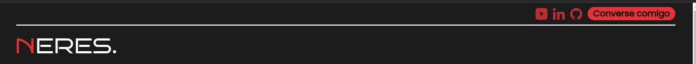
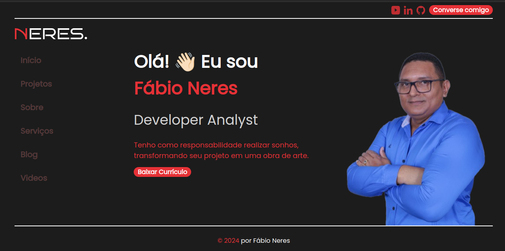

# DevPortfolio-HTML-CSS-JS

Bem-vindo ao DevPortfolio, um repositório que encapsula meu processo de desenvolvimento web ao criar a página inicial de um portfólio para um desenvolvedor front-end. Este projeto foi desenvolvido utilizando HTML, CSS e JavaScript, e tem como objetivo servir tanto como uma apresentação para recrutadores quanto como um guia/tutorial para entusiastas que desejam aprender e se inspirar.

## Autor

| [<br><sub>Fábio Neres</sub>](https://github.com/neresfabio) | Olá, sou o desenvolvedor por trás deste projeto, DevPortfolio-HTML-CSS-JS. Sou apaixonado por transformar ideias em código e criar experiências digitais envolventes. |
| :--------------------------------------------------------------------------------------------------------------------------------------------------: | :-------------------------------------------------------------------------------------------------------------------------------------------------------------------: |

### O que me motiva:

Minha jornada no desenvolvimento web é alimentada pela busca incessante de aprender, crescer e superar desafios no mundo da programação. Acredito no poder da tecnologia para impulsionar mudanças significativas e estou constantemente explorando novas formas de inovar.

## Prototipagem Inicial do Projeto

Durante meu percurso de estudos, conversas com profissionais e participação em bootcamps, acumulei conhecimento suficiente para desenvolver um protótipo inicial para este projeto. A imagem abaixo representa o modelo que elaborei, refletindo a aplicação prática do aprendizado adquirido.

**🚧🚧EM CONSTRUÇÃO🚧🚧**


Este protótipo é meu projeto pessoal, um site totalmente autoral, e meu objetivo é expandi-lo utilizando outras tecnologias. Ao longo do desenvolvimento, planejo aplicar meu conhecimento em backend, explorando tecnologias voltadas para essa área.

Considerando que meu estudo mais profundo está focado em backend, agora me sinto à vontade para mergulhar na stack completa e aprimorar minhas habilidades como desenvolvedor fullstack.

Sem conseguir conter minha empolgação após obter um template aceitável, compartilho com vocês a versão inicial criada utilizando as tecnologias básicas do desenvolvimento web.

**Detalhes Técnicos:**

- [FIGMA](https://www.figma.com/): foi utilizada para a prototipagem, proporcionando uma abordagem eficiente e visual para a criação do modelo, para quem não tem criatividade no começo é dificil, mas com a pratica tudo se torna facil.

**Objetivos Futuros:**

- Explorar e implementar tecnologias backend no projeto.
- Aprimorar a experiência do usuário e funcionalidades ao longo do desenvolvimento.

## Arquitetura do Projeto

Durante uma das formações que tive a oportunidade de participar, fui apresentado a uma estrutura de projeto que resolvi adotar. Este conceito de padrão é fundamental para a organização eficiente de um projeto. Ter as coisas padronizadas não apenas proporciona agilidade na localização de arquivos, mas também traz consistência ao código, facilitando a manutenção e a colaboração.

### Estrutura Adotada

A estrutura do projeto segue uma abordagem organizada, dividida em componentes bem definidos. Aqui estão alguns pontos-chave:

- **Pastas e Subpastas:** Componentes, estilos, scripts e assets estão separados em pastas dedicadas, mantendo uma estrutura lógica e fácil de navegar.

- **Padrões de Nomenclatura:** A aplicação de padrões de nomenclatura uniformes torna a identificação de arquivos e componentes mais intuitiva, contribuindo para uma experiência de desenvolvimento mais fluida.

### Vantagens da Padronização

A padronização traz diversas vantagens para o projeto:

- **Agilidade:** A localização rápida de arquivos e recursos agiliza o desenvolvimento e a manutenção.

- **Consistência:** A consistência no código facilita a compreensão e colaboração entre membros da equipe.

- **Escalabilidade:** Uma estrutura padronizada torna o projeto mais escalável, adaptando-se facilmente ao crescimento e à introdução de novos recursos.

### Exemplos de Padrões

Para ilustrar, alguns dos padrões adotados incluem:

- **Estrutura de Pastas:** `assets/images`, `assets/styles`, `assets/scripts`, `app.html`
- **Convenções de Estilo:** Utilização consistente de indentação, espaçamento e outras práticas recomendadas.

### Referências e Aprendizado

A estrutura adotada foi fortemente influenciada pela formação **[Front end JavaScript Junior](https://drive.google.com/file/d/14V_E9EXbEsXhQxlwVSqc7ut8eJ6EsSt9/view?usp=sharing)**, que enfatizou a importância da organização e padronização para um desenvolvimento eficaz.

Ao adotar essa arquitetura, busco não apenas organizar o projeto, mas também criar um ambiente propício para colaboração e crescimento contínuo.

## 🕵🏾‍♂️ Inspecionando o Protótipo

Antes de começar a codificar, é crucial inspecionar detalhadamente o protótipo e identificar as partes fundamentais da estrutura do site. Essa etapa é essencial para planejar o esqueleto do HTML e garantir uma implementação eficiente.

### Ferramentas Utilizadas

Durante a inspeção do protótipo, não utilizei ferramentas especificas, o proprio figma contém recursos que você pode utilizar, mas aqui me basiei so na imagem e meu conhecimento prévio em Html.

### Elementos-Chave Identificados

1. **Cabeçalho (Header):**

   - O cabeçalho apresenta ícones de redes sociais e um botão de ação, todos alinhados à direita da página.
   - Uma linha divisória separa a logo, que está alinhada à esquerda.

2. **Seções Principais:**

   - Uma coluna lateral à esquerda, abaixo da logo, contém botões para as seções do site (Início, Projetos, Sobre, ...).
   - Ao lado dessa coluna, há um título, subtítulo, parágrafo, botão de ação e uma imagem grande.

3. **Rodapé (Footer):**
   - O rodapé inclui apenas um aviso de copyright.

Essa identificação detalhada dos elementos-chave será útil ao criar a estrutura do HTML.

## 👨🏾‍💻 Desenvolvimento

### Estrutura HTML:

- [x] Criar estrutura basica do HTML
- [x] Adicionar as tags `header`, `nav`,`main` e `footer`

```html
<!DOCTYPE html>
<html lang="pt-BR">
  <head>
    <meta charset="UTF-8" />
    <meta name="viewport" content="width=device-width, initial-scale=1.0" />
    <title>Portifólio</title>
  </head>
  <body>
    <header>
      <!-- CABEÇALHO -->
    </header>
    <nav>
      <!-- MENU LATERAL -->
    </nav>
    <main>
      <!-- CONTEUDO PRINCIPAL -->
    </main>
    <footer>
      <!-- RODAPÉ DA PÁGINA -->
    </footer>
  </body>
</html>
```

### Topo da Página:

- [x] Adicionar as redes sociais no topo da página.
- [x] Adicionar um botão (fale comigo)
- [x] Adicionar logo.
- [x] Adicionar uma divisão entre a logo e as redes sociais

```html
<header>
        <!-- rede social -->
        <ul class="group-social">
            <li>
                <a href="#">youtube</a>
            </li>
            <li>
                <a href="#">linkedin</a>
            </li>
            <li>
                <a href="#">instagram</a>
            </li>
            <li>
                <a href="#">github/a>
            </li>
        </ul>
        <!-- botão -->
        <button>Fale comigo</button>
        <!--  divisão -->
        <div class="divider"></div>
        <!-- Logo -->
        <h1>Logo</h1>
    </header>
```

## Menu de Navegação:

- [x] Desenvolva o menu de navegação vertical à esquerda.
- [x] Adicionar links para as seções principais do site.

```html
<nav class="menu-lateral">
  <!-- MENU LATERAL -->
  <ul>
    <li>
      <a href="#" target="_blank">Início</a>
    </li>
    <li>
      <a href="#" target="_blank">Projetos</a>
    </li>
    <li>
      <a href="#" target="_blank">Sobre</a>
    </li>
    <li>
      <a href="#" target="_blank">Serviços</a>
    </li>
    <li>
      <a href="#" target="_blank">Blog</a>
    </li>
    <li>
      <a href="#" target="_blank">Videos</a>
    </li>
  </ul>
</nav>
```

## Conteúdo da Main:

- [x] Adicione as sessões
- [x] Link as sessões no menu lateral
- [x] Adicione na sessão principal(inicio).
  - Titulo
  - Inclua uma breve descrição sobre você e seu trabalho.
  - Insira um botão para fazer o download do seu CV.
  - Adicione uma imagem representativa.

```html
<nav class="menu-lateral">
  <!-- MENU LATERAL -->
  <ul>
    <li>
      <a href="#inicio" target="_blank">Início</a>
    </li>
    <li>
      <a href="#projetos" target="_blank">Projetos</a>
    </li>
    <li>
      <a href="#sobre" target="_blank">Sobre</a>
    </li>
    <li>
      <a href="#serviços" target="_blank">Serviços</a>
    </li>
    <li>
      <a href="#blog" target="_blank">Blog</a>
    </li>
    <li>
      <a href="#videos" target="_blank">Videos</a>
    </li>
  </ul>
</nav>
<main>
  <!-- CONTEUDO PRINCIPAL -->
  <section id="inicio">
    <h1>Titulo</h1>
    <h2>Lorem ipsum, dolor sit amet.</h2>
    <button>Baixa curriculo</button>
    
  </section>
  <section id="projetos"></section>
  <section id="sobre"></section>
  <section id="serviços"></section>
  <section id="blog"></section>
  <section id="videos"></section>
</main>
```

## Roda pé da página:

- [x] Adicione o ano e e nome do desenvolvedor.

```html
<footer>
  <!-- RODAPÉ DA PÁGINA -->
  © 2024 por Fábio Neres
</footer>
```

Com isso temos nossa primeira versão para iniciar.


## Estilização do CSS:

- [x] Crie um arquivo CSS para estilizar a página.
- [x] Estilize o layout para garantir que os elementos estejam posicionados conforme o design no Figma.
- [x] Adicione estilos aos links, botões e outras partes da página conforme necessário.

Aqui optei por adicionar um arquivo de padronização do site `pattern.css`, nele colocarei os estilos que se reptirão durante o desenvolvimento, por tanto, sempre que um estilo se repertir em todo o projeto atribuirei um nome especico para reutiliza-lo.

Utilizar um arquivo separado para padronização dos estilos, como o `./styles/pattern.css`, é uma prática recomendada que promove a reutilização e a manutenção do código CSS de forma eficiente. Isso facilita a consistência visual em todo o projeto e simplifica a implementação de alterações globais nos estilos.

```css
/* Estilos para o cabeçalho */
.header {
  /* Estilos para o cabeçalho */
}

.logo {
  /* Estilos para a logo */
}

.social-icons {
  /* Estilos para os ícones de rede social */
}

/* Estilos para o rodapé */
.footer {
  /* Estilos para o rodapé */
}

.copyrit {
  /* Estilos para o aviso de copyright */
}

/* Estilos para botões */
.btn {
  /* Estilos básicos para botões */
}

.btn-primary {
  /* Estilos para botão primário */
}

.btn-secondary {
  /* Estilos para botão secundário */
}

/* Outros estilos padronizados... */
```

Outro tipo de arquivo que adicionei é o de `reset.css`. Incluir um arquivo de reset.css é uma prática comum e útil no desenvolvimento web. Esse tipo de arquivo ajuda a garantir que todos os navegadores comecem com estilos de CSS consistentes, removendo as diferenças padrão entre eles. Isso é especialmente importante para evitar inconsistências de estilo e garantir uma base sólida para a estilização personalizada do seu site.

Aqui estão algumas dicas para usar e organizar seu arquivo reset.css:

Reset vs Normalize:

Existem duas abordagens principais para normalizar estilos entre navegadores: reset e normalize. Um arquivo de reset remove todos os estilos padrão dos navegadores, enquanto um arquivo de normalize mantém alguns estilos padrão e ajusta outros para garantir uma experiência mais consistente. Escolha a abordagem que melhor atenda às necessidades do seu projeto.
Ordem de Importação:

Importe o arquivo reset.css antes de quaisquer outros arquivos de estilo no seu documento HTML para garantir que os estilos sejam aplicados corretamente e não sejam substituídos por estilos padrão do navegador.
Personalização:

Após aplicar o reset, você pode adicionar estilos personalizados para criar a aparência desejada do seu site. Certifique-se de adicionar esses estilos após o reset.css para evitar que sejam substituídos.
Comentários Descritivos:

Adicione comentários descritivos no arquivo reset.css para explicar o propósito de diferentes seções de reset. Isso ajudará você e outros desenvolvedores a entenderem o motivo por trás das alterações nos estilos padrão.
Versionamento e Atualizações:

Mantenha o arquivo reset.css versionado e documente quaisquer alterações significativas. Isso ajudará a rastrear as mudanças e garantir consistência ao longo do tempo.

Aqui está um exemplo básico de como um arquivo reset.css pode ser estruturado:

```css
/* Reset de estilos para elementos HTML comuns */

html,
body,
div,
span,
h1,
h2,
h3,
h4,
h5,
h6,
p,
blockquote,
pre,
a,
abbr,
address,
cite,
code,
del,
dfn,
em,
img,
ins,
kbd,
q,
samp,
small,
strong,
sub,
sup,
var,
b,
i,
dl,
dt,
dd,
ol,
ul,
li,
fieldset,
form,
label,
legend,
table,
caption,
tbody,
tfoot,
thead,
tr,
th,
td,
article,
aside,
canvas,
details,
figcaption,
figure,
footer,
header,
hgroup,
menu,
nav,
section,
summary,
time,
mark,
audio,
video {
  margin: 0;
  padding: 0;
  border: 0;
  outline: 0;
  font-size: 100%;
  vertical-align: baseline;
}

/* Outras regras de reset de estilos... */
```

### `pattern.css`

- [x] `root`: Em contextos relacionados ao desenvolvimento web e CSS, o termo "root" geralmente se refere ao pseudo-elemento :root. Esse pseudo-elemento representa o elemento raiz do documento, que é o elemento HTML (<html>). O :root é frequentemente usado para definir variáveis CSS globais, também conhecidas como variáveis personalizadas, que podem ser acessadas e reutilizadas em todo o documento CSS. Isso permite uma maneira eficiente de manter consistência visual e simplificar a aplicação de estilos em vários elementos.

```css
:root {
  --primary-color: #e63136; /*Define uma variavel --primary-color*/
  --second-color: #55393a; /* Define uma variável --second-color */
  --font-primary-color: #ffffff; /* Define uma variável --white-color */
  --bg-page: #1c1c1c;
}
/* Container padrão */
.container {
  width: 100%;
  max-width: 1246px;
  margin: 0 auto;
  padding: 0rem 1.5rem;
}
/* Fonte padrão do h2 */
h2 {
  color: var(--font-primary-color);
}
/*Este seletor aplica um estilo que utiliza Flexbox para alinhar os itens ao centro verticalmente e justificar o conteúdo à direita. */
.flex-center-right {
  display: flex;
  align-items: center;
  justify-content: flex-end;
}
/* Este seletor aplica um estilo que utiliza Flexbox para alinhar os itens ao centro verticalmente. */
.flex-items-center {
  display: flex;
  align-items: center;
}
```

### `reset.css`

Conjunto de regras globais que são aplicadas a todos os elementos (\*) e a elementos específicos como `html`, `img`, `button` e `body`.

**Regra**:

1. \*: Define estilos para todos os elementos HTML.

- `margin: 0;` `padding: 0;`: Remove margens e preenchimentos padrão dos elementos.
- `box-sizing: border-box;`: Define a caixa de modelagem como border-box para garantir que a largura e a altura incluam o preenchimento e a borda, mas não a margem.
- `list-style: none;`: Remove estilos de lista padrão (como pontos/bolinhas) de listas.
- `text-decoration: none;`: Remove decoração de texto padrão (como sublinhado) de links.
- `font-family: "Poppins", sans-serif;`: Define a família de fontes padrão para todos os elementos como "Poppins" e, se não estiver disponível, para uma fonte sans-serif genérica.

2. `html`: Define estilos para o elemento HTML.

- `font-size: 62.5%;`: Define o tamanho da fonte base como 62.5% do tamanho padrão (geralmente usado para facilitar a conversão de rem para pixels).
- `scroll-behavior: smooth;`: Adiciona um comportamento de rolagem suave para a página.

3. `img`: Define estilos para elementos de imagem.

- `max-width: 100%;`: Garante que as imagens não excedam a largura do contêiner pai.
- `display: block;`: Define as imagens para exibição como bloco.

4. `button`: Define estilos para botões.

- `cursor: pointer;`: Define o cursor como ponteiro para indicar que o elemento é clicável.

5. `body`: Define estilos para o corpo do documento.

- `background-color: var(--bg-page);`: Define a cor de fundo do corpo como a variável CSS `--bg-page`.
- `font-size: 1.6rem;`: Define o tamanho da fonte como 1.6 rem.
- `webkit-font-smoothing: antialiased;`: Aplica antialiasing para melhorar a qualidade da exibição de fontes em navegadores WebKit.

> Trabalhei em projetos que não possuiam documentação, e pude aplicar um pouco do meu conhecimento em padronização, sempre me deparava com `tags` que possuiam mais de um estilo, quando não era estilo padrao do html, pegava o estilo de qualquer outro framework que tivesse vinculo com o projeto, por ser monolítico, possuia integração com varias ferramentas, e tentar manipular isso era bastante danoso.

## Customização do cabeçalho



### HTML

```html
<header>
  <div class="container">
    <!--botões de navegação social-->
    <div class="group-social flex-center-right">
      <ul class="flex-items-center">
        <li>
          <a href="https://#" target="_blank">
            
          </a>
        </li>
        <li>
          <a
            href="https://#"
            target="_blank"
          >
            
          </a>
        </li>
        <li>
          <a href="https://#" target="_blank">
            
          </a>
        </li>
      </ul>
      <button class="bt-conversa" type="button">Converse comigo</button>
    </div>
    <div class="divider"></div>
    <!--logo-->
    
  </div>
</header>
```

### css

```css
/* HEADER */
.group-social {
  padding: 8px 0;
}
.icon-social {
  width: 22px;
}
.flex-items-center li {
  margin-right: 10px;
}
button {
  border: none;
  padding: 0rem 1rem;
  border-radius: 2rem;
  background-color: var(--primary-color);
  color: var(--font-primary-color);
  font-size: 16px;
  font-weight: 700;
}
button:hover {
  background-color: #18d107;
}
.divider {
  height: 2px;
  width: 100%;
  background-color: var(--bg-white);
  margin-bottom: 24px;
}
.logo {
  margin-bottom: 24px;
}
```

### Div, Nav, Main

```html
<div class="container flex-space-between">
  <nav class="menu-left">
    <!--lista de navegação-->
    <ul class="menu">
      <li class="active" onclick="changeActive(this)">
        <a class="item-menu" href="#">Início</a>
      </li>
      <li class="" onclick="changeActive(this)">
        <a class="item-menu" href="#">Projetos</a>
      </li>
      <li class="" onclick="changeActive(this)">
        <a class="item-menu" href="#">Sobre</a>
      </li>
      <li class="" onclick="changeActive(this)">
        <a class="item-menu" href="#">Serviços</a>
      </li>
      <li class="" onclick="changeActive(this)">
        <a class="item-menu" href="#">Blog</a>
      </li>
      <li class="" onclick="changeActive(this)">
        <a class="item-menu" href="#">Videos</a>
      </li>
    </ul>
  </nav>
  <main>
    <div class="left-content">
      <h1 class="title">Olá! 👋🏻 Eu sou <br /><span>Fábio Neres</span></h1>
      <h2 class="sub-title">Developer Analyst</h2>
      <p>
        Tenho como responsabilidade realizar sonhos, transformando seu projeto
        em uma obra de arte.
      </p>
      <button class="btn-cv" type="button">Baixar Currículo</button>
    </div>
    <div class="right-content">
      
    </div>
  </main>
</div>
```

### Footer

```html
<footer>
  <!--informações-->
  <span>© 2024</span> por Fábio Neres
</footer>
```
Se chegou até aqui, esse é o possivel resultado, não me aprofundei em detalhar linha a linha do codigo, por falta de tempo, como falei anteriormente esse é meu projeto pessoal e para não me prender nesse repositório finalizo por aqui.



> Com isso ja é possivel inicar seu projeto. Seja criativo e modifique a seu gosto.

## Próximos passos

- [ ] Criar as proximas sessões
- [ ] Adicionar Formulário


